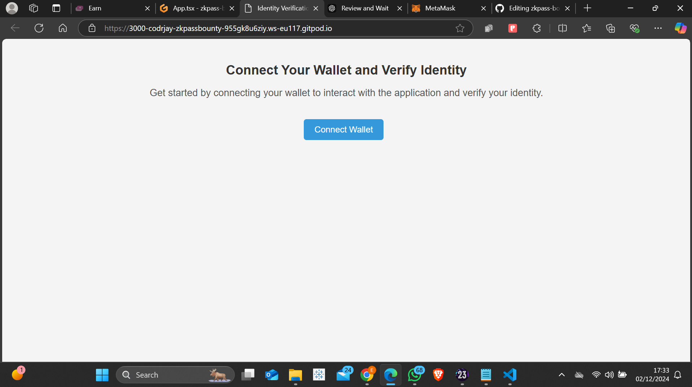
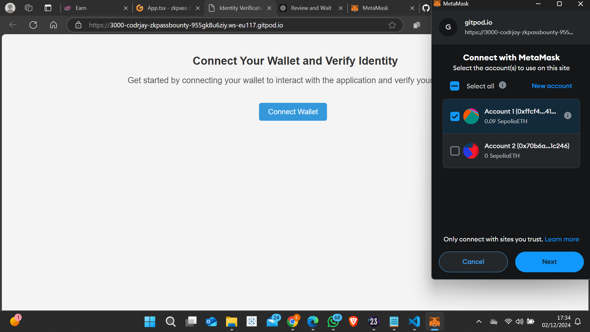
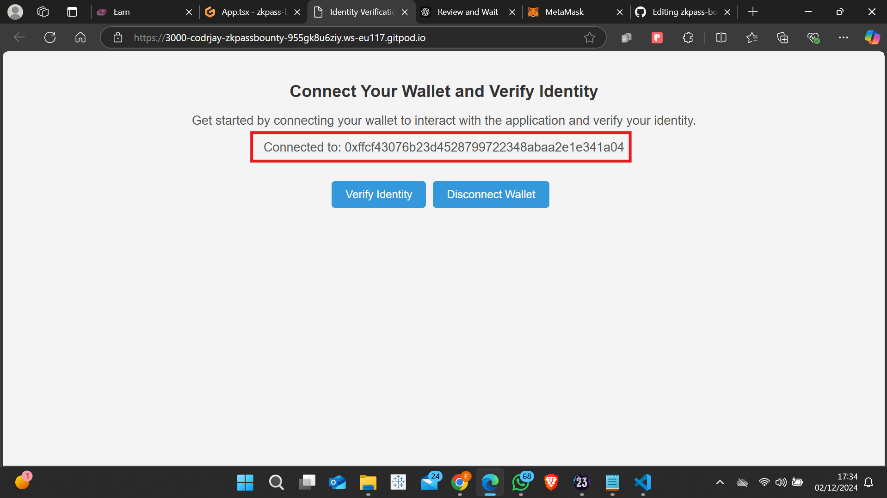
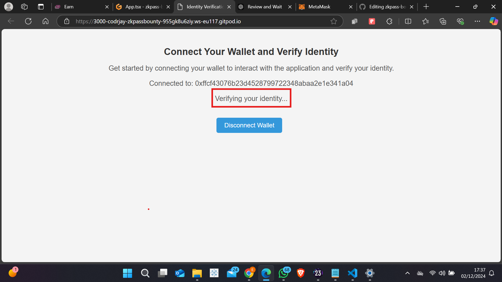
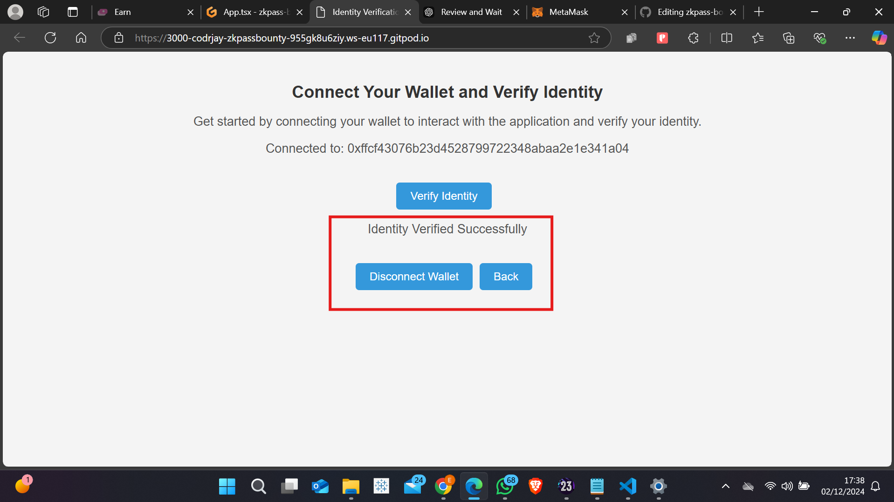

# Connect and Verify Your Wallet

## Overview
This project is a decentralized web application designed to allow users to connect their Ethereum wallet (such as MetaMask) and verify their identity via zkPass, a zero-knowledge proof (ZKP)-based verification service. The app ensures a smooth user experience by allowing users to seamlessly connect their wallet, verify their identity, and handle wallet disconnections. Additionally, the user can navigate back to the previous page after completing the identity verification process.

This application combines the power of blockchain and privacy-focused identity verification with zkPass to deliver a secure and user-friendly experience.

## Features
### 1. Connect Wallet
- Users can easily connect their Ethereum wallet (e.g., MetaMask) by clicking the "Connect Wallet" button.
- Every time the button is clicked, the application requests permission from MetaMask to connect to the user’s wallet.
- Upon successful connection, the wallet address is displayed on the screen, confirming the connection.

### 2. Verify Identity
- After connecting the wallet, users can proceed to verify their identity using zkPass.
- When the "Verify Identity" button is clicked, the application sends the user's wallet address to the zkPass API for identity verification.
- The verification status is displayed, indicating whether the identity verification was successful or not.
- If verification fails, the app will notify the user accordingly.

### 3. Back Functionality
- After the user completes the identity verification process, the "Back" button appears.
- Clicking the "Back" button takes the user to the previous page using React Router’s `history.goBack()` method.

### 4. Disconnect Wallet
- Users can disconnect their wallet at any time by clicking the "Disconnect Wallet" button.
- When clicked, the wallet connection is cleared, and the app's state is reset, ensuring that the user is no longer connected.

## How It Works
### 1. MetaMask Integration
- The app utilizes the MetaMask extension to allow users to connect their Ethereum wallet.
- When the "Connect Wallet" button is clicked, the app requests access to the user's Ethereum account using `window.ethereum.request({ method: 'eth_requestAccounts' })`. This triggers MetaMask's prompt, asking the user to approve the connection.

### 2. Identity Verification with zkPass
- Once the wallet is connected, users can click the "Verify Identity" button to send a request to the zkPass API.
- The app makes an HTTP POST request with the user’s wallet address (and other necessary data) to the zkPass API endpoint.
- If the verification is successful, the user is notified that their identity is verified. If not, the app will notify the user of the failure.

### 3. Back and Disconnect Buttons
- The "Back" button will only appear after the identity verification process is complete.
- The "Back" button uses React Router’s `useHistory` hook and the `goBack()` method to navigate the user back to the previous page.
- The "Disconnect Wallet" button will clear the wallet’s connection and reset the app’s state, allowing the user to disconnect their wallet whenever they choose.

## Installation
1. Clone this repository:

   ```bash
   git clone https://github.com/your-username/connect-wallet-verify.git
   cd connect-wallet-verify
   ```

2. Install the dependencies:

   ```bash
   npm install
   ```

3. Start the development server:

   ```bash
   npm start
   ```

4. Open your browser and navigate to [the website]([(https://codrjay.github.io/zkpass-bounty)) to see the app in action.

## Prerequisites
- MetaMask or another Ethereum wallet extension installed in your browser to connect the wallet.
- zkPass API: This application interacts with zkPass for identity verification. Ensure you have the appropriate credentials for using their service.

## Technologies Used
- **React**: A JavaScript library for building user interfaces.
- **Ethereum (MetaMask)**: A popular Ethereum wallet that enables users to manage their accounts and interact with decentralized applications.
- **zkPass**: A zero-knowledge proof-based identity verification platform.
- **Axios**: A promise-based HTTP client for making requests to APIs.
- **React Router**: For handling routing and navigation in the app.

## Screenshots
### Wallet Connection Screen


### Permissions screen


### Successful connection


### Verifying identity


### Successful verification


## Usage
### 1. Connecting Wallet
- When you first visit the app, you'll be prompted to click the "Connect Wallet" button. This will trigger MetaMask to ask for your permission to connect your wallet.
- After you approve the connection, your wallet address will be displayed, and you'll be able to proceed with identity verification.

### 2. Verifying Identity
- After connecting your wallet, click the "Verify Identity" button.
- The app will make a request to the zkPass API to verify your identity. The status of the verification will be shown on the screen.

### 3. Back Functionality
- Once the identity verification is complete, you can click the "Back" button to navigate back to the previous page.

### 4. Disconnect Wallet
- You can disconnect your wallet at any time by clicking the "Disconnect Wallet" button. This will clear the wallet address and reset the app's state.

## Conclusion
This project demonstrates the seamless integration of MetaMask for wallet connections and zkPass for identity verification in a decentralized application. The clean UI and smooth functionality ensure a pleasant user experience, whether you're connecting your wallet, verifying your identity, or disconnecting from the app. This is an excellent foundation for building privacy-focused, blockchain-integrated applications.

## Future Improvements
- **Enhanced Error Handling**: Implement better error messages and recovery options in case of failed wallet connections or API issues.
- **Multi-wallet Support**: Support multiple wallet providers (e.g., Trust Wallet, Coinbase Wallet).
- **UI/UX Enhancements**: Improve the overall design to make it even more user-friendly.
- **Testing and Optimization**: Add unit and integration tests to ensure the robustness of the application.


